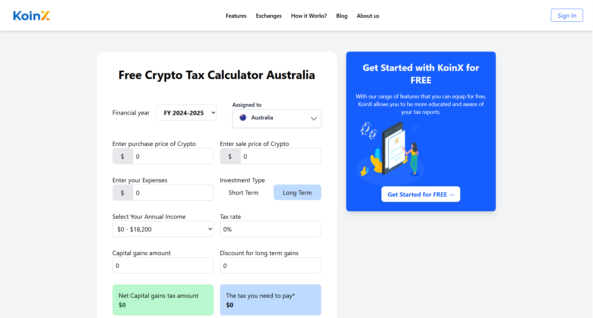

# 📊 KoinX - Crypto Tax Calculator

KoinX is a crypto tax calculator that helps users find out their capital gains and the amount of tax they need to pay based on their crypto transactions in Australia.  
Users just need to enter the purchase price, sale price, expenses, investment type (short or long term), and annual income — and the tool will do the math.

---
## 📸 Preview of the App

Here's how the KoinX Crypto Tax Calculator looks:

___

## 🔗 Live Demo

👉 [KoinX Live Demo](https://koin-x-react.vercel.app/)

---

## 🚀 Features

- **Dynamic Tax Rate** — Changes based on selected annual income.
- **Capital Gains Calculation** — Calculates gains using purchase, sale price, and expenses.
- **Investment Type (Short/Long Term)** — Applies long-term discount if applicable.
- **Tax Estimation** — Calculates tax based on net gains and income bracket.
- **Responsive Design** — Clean UI using Tailwind CSS.

---

## 🛠 Tech Stack

- **React** – JavaScript library for UI and logic
- **Tailwind CSS** – Utility-first CSS framework
- **React Icons** – For using icons like dropdowns, arrows, etc.
- **JavaScript (ES6+)** – To handle logic and calculations

---

## 📈 How It Works

### 1. Select Annual Income
- Choose your income range from dropdown.
- The tax rate will update based on the selected range.

### 2. Calculate Capital Gains
Formula used: Capital Gains = Sale Price - Purchase Price - Expenses

### 3. Choose Investment Type
- **Short Term**: Full capital gains are considered for tax.
- **Long Term**: 
  - If gains are positive, 50% discount is applied.
  - Net Capital Gains = Capital Gains - 50% of Capital Gains

### 4. Tax Calculation
- Tax is calculated using: Tax = (Net Capital Gains × Applicable Tax Rate) / 100

## 📚 What I Learned

- Working with dynamic form inputs in React
- Using conditional rendering based on user choices
- Managing multiple states and updates
- Applying real-world tax calculation logic
- Using Tailwind CSS for a responsive UI without custom CSS

---
